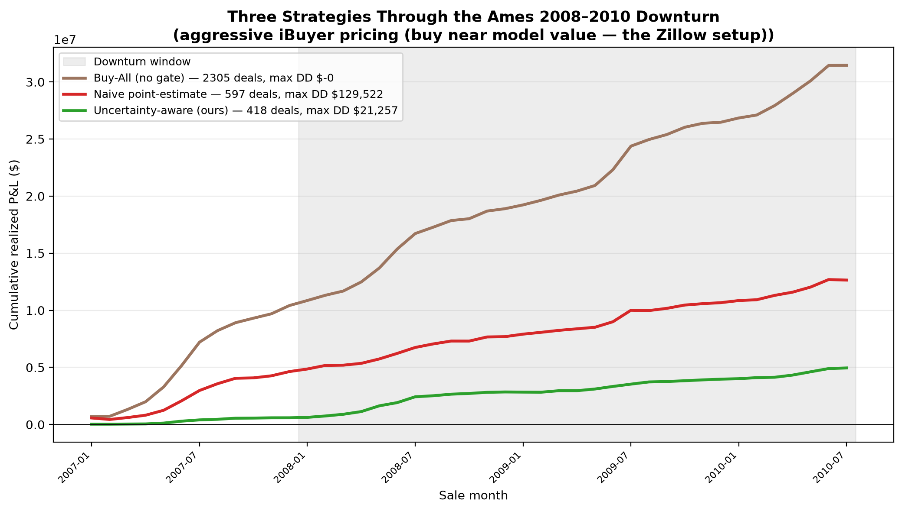

# Margin of Error

> Accurate is not underwritable. A model's margin of error has to be smaller
> than the deal's profit margin, or you're not investing — you're gambling
> with extra steps.

## Why I built this

In 2021, Zillow shut down Zillow Offers, the arm of the company that used
their pricing algorithm to buy houses directly, touch them up, and flip them.
They lost hundreds of millions of dollars doing it. But the model wasn't that bad. 
It was a decent price predictor.
The mistake was treating a single predicted number as if it were a safe
buying decision, when the honest uncertainty around that number was wider
than the profit they were chasing. 

Meanwhile, every data science student on earth (me included) learns
regression on the Ames housing dataset by chasing a lower RMSE and calling it
a day. Those two facts together are the whole project. This project asks:

**Is the model certain enough about *this* house to bet real money on it?**

Answering that properly took five phases: 
1. a solid baseline price model,
2. a calibrated uncertainty layer wrapped around it
3. a causal look at which renovations actually create value
4. a walk-forward backtest through the 2007–2010 downturn
5. an app to be able to actually use it

If you want the full plain-English walkthrough — every concept explained from
scratch, every number interpreted, refer to
[docs/PROJECT_EXPLAINER.md](docs/PROJECT_EXPLAINER.md). It is very long, but it's
the document I'd hand someone who wanted to really get it. 



## What I found

The short version, with the numbers that matter. (Every figure here is
written by the pipeline into a JSON "metric card" under `reports/` — nothing
is typed in by hand, and you can check all of it.)

**The baseline model is respectable and still dangerous.** LightGBM gets a
log-RMSE of 0.135, which would make a Kaggle notebook proud. In dollars,
though, it misses a typical Ames house by $9,413 — and one house in five by
more than $22,193. A typical flip in this market targets maybe $10–20k of
profit. So the model's *routine* miss can eat the entire deal. That's Phase 1,
and it's the setup for everything else.

**Forced to state honest uncertainty, the model confesses.** Phase 2 wraps
the point model in a conformalized quantile regression interval — a 90% value
range that's been calibrated on held-out data rather than just asserted. The
calibration is real: the "90%" interval covered the truth 90.4% of the time
on 292 test homes. The uncomfortable part is the width. The median honest
range is **$64,025 wide**, in a market where the median house sells for
$163,000. The model was never lying before; nobody had asked it to tell the
whole truth.

**The uncertainty gate refuses exactly the deals a naive model loves.** The
underwriting rule (approve only if there's a ≥65% chance of clearing a $15k
profit buffer, ≤20% chance of loss, and the value interval is under $60k)
declined 164 of the 292 test homes — every single one for excess model
uncertainty. And the 50 homes a naive point-estimate ranking rated as its
best opportunities? Declined, 50 out of 50. The "best deals" a point model
finds are mostly the houses it's most wrong about. That's the Zillow trap,
quantified.

**Naive renovation math can be off by an order of magnitude, in either
direction.** Phase 3 uses double machine learning to separate "this feature
causes value" from "nice houses have this feature." The flagship example is
exterior quality: plain OLS says a one-step upgrade is worth $425; the causal
estimate says $5,634. Confounding *hid* a real effect thirteen-fold. Kitchen
quality, meanwhile, was roughly honest either way ($4,146 vs $4,450). And in
the end, swapping causal for correlational assumptions flipped zero
underwriting verdicts — because no renovation story survives a $64k value
interval. The gate dominates.

**The discipline pays exactly where Zillow lived.** Phase 4 replays 2006–2010
with no time travel: train only on the past, retrain annually, buy or pass
month by month. Ames only fell 6.1% peak-to-trough (this is Iowa, not
Phoenix), and under the traditional fat-margin "70% rule" the gate barely
matters — every strategy sails through with zero drawdown. But under
thin-margin iBuyer-style pricing (buying at 85% of predicted value), the
naive rule took a **$129,522** max drawdown with a 76.6% crash hit rate,
while the uncertainty-aware rule took **$21,257** and 88.1%. It also made
less total money, and I think that's the most honest number in the project:
the gate declined marginal deals that mostly worked out *in a mild downturn*.
It's insurance. Insurance looks like foregone profit right up until the year
it saves the firm.

## Poking at the results yourself

You don't need to run anything to check my work — all outputs are committed.

The **metric cards** are the source of truth. One JSON file per phase, each
containing the headline numbers plus a snapshot of the exact config the run
used:

```bash
python3 -m json.tool reports/phase2_metric_card.json
```

A few pointers on what's inside: the Phase 2 card's `calibration_curve` block
is the honesty audit (promised vs delivered coverage at six levels), and its
`headline` block has the verdict counts and the 50-of-50 rejection. The Phase
4 card is the richest — `strategies.ibuyer` and `strategies.conservative_flip`
each hold buy-all / naive / uncertainty-aware results with deals, profit,
drawdown, and hit rates.

The **figures** in `reports/figures/` are numbered by phase. The ones I'd
look at first: `02a_confrontation.png` (point estimates meeting their honest
intervals), `02d_calibration.png` (the coverage audit),
`03a_confounding_gap.png` (naive vs causal renovation effects), and
`04b_three_strategies_pnl.png` (the signature chart — three strategies racing
through the downturn under thin margins). Its foil,
`04c_conservative_regime_pnl.png`, shows the same race under fat margins
where nothing draws down — the contrast is the thesis.

The **per-home tables** are there too if you want to drill in:
`phase2_test_underwriting.csv` has all 292 test homes with intervals, profit
stats, and verdicts; `phase4_backtest_periods.csv` is the month-by-month
backtest ledger.

And if you disagree with an economic assumption — renovation costs, hold
times, margin thresholds — every one of them lives in
`config/economics.yaml` with a written rationale, not in code. (There's a
test that fails if a dollar constant shows up in source.) Change the YAML,
re-run, and the metric cards regenerate under your numbers. The full catalog
with sensitivity flags is in [docs/assumptions.md](docs/assumptions.md), and
the judgment calls behind the design are logged as ADRs in
[docs/decisions.md](docs/decisions.md).

Reading order for the prose, if you want it: the
[explainer](docs/PROJECT_EXPLAINER.md) for depth, the
[memo](reports/memo.md) for the one-page executive version, the
[app guide](docs/APP_GUIDE.md) for driving the tool, and the
[deck outline](reports/deck_outline.md) if you're presenting it.

## The app

`make app` launches the Phase 5 Streamlit tool. It loads the saved artifacts
(Phase 1 point model, Phase 2 interval model, Phase 3 causal uplifts — no
retraining at runtime), takes the property facts an underwriter would
actually have on hand, and fills the rest of the Ames feature vector from
dataset medians. Out comes the full screen: the verdict with the three
checks that produced it (each shown with this house's numbers against its
threshold), the calibrated 90% value range, the simulated profit
distribution, causal renovation guidance, and every assumption behind the
numbers in plain English. If an artifact is missing it tells you which make
targets to run instead of stack-tracing at you.

There's a full guide to the app — every input and output explained, how to
read the charts, and a set of one-minute experiments that reproduce the
project's findings — in [docs/APP_GUIDE.md](docs/APP_GUIDE.md).

## Running it

```bash
make setup          # venv, pinned deps, pre-commit hooks
# ...then add the two raw data files — data/README.md has copy-paste commands
make data-check

make train          # Phase 1
make uncertainty    # Phase 2
make causal         # Phase 3
make backtest       # Phase 4
make app-artifacts  # Phase 5

make lint
make test

make app
```

`make all` does the whole non-interactive pipeline in one shot. Runs are
seeded and dependencies pinned, so the metric cards should reproduce exactly.

## Layout

```text
margin-of-error/
├── config/          # model.yaml + economics.yaml — every assumption lives here
├── data/            # raw files git-ignored; data/README.md explains how to get them
├── docs/            # explainer, ADR log, assumptions catalog
├── models/          # saved artifacts: Phase 1 LightGBM, Phase 2 CQR, Phase 5 defaults
├── notebooks/       # the narrative; real logic is imported from src/
├── reports/         # metric cards, CSVs, figures, memo, deck outline
├── src/margin_of_error/
│   ├── app/         # Streamlit tool + artifact loaders
│   ├── backtest/    # walk-forward stress test
│   ├── causal/      # cross-fitted DML
│   ├── economics/   # profit Monte Carlo + verdict rule
│   ├── models/      # baseline + CQR
│   └── viz/         # the charts
└── tests/
```

One engineering rule I held myself to throughout: each phase loads the
previous phase's saved artifact rather than quietly retraining, so Phase 2
genuinely analyzes the same model Phase 1 built. It sounds small; it's the
difference between a pipeline and a pile of notebooks.

## Data

Phases 1–3 use the Kaggle Ames competition training split (1,460 sales,
median price $163,000). That split is random, which is fine for
cross-sectional questions and exactly wrong for temporal ones — so Phase 4
switches to the full De Cock dataset (2,930 sales, 2006–2010, sorted by sale
date) for the backtest. Raw data isn't committed;
[data/README.md](data/README.md) has download commands for both.

## What this isn't

A live investment product. Ames is one small Midwestern market and its
"crash" was a 6.1% drift. The backtest buys at synthetic prices (a factor
times predicted value) because the dataset records sales, not real
buy-renovate-resell projects — it stress-tests the underwriting *rule*, not a
literal P&L. The causal layer is observational, so unmeasured things like
owner wealth and contractor quality can still bias it. Renovation costs are
documented national averages, not Iowa contractor bids.

I've tried to say all of that plainly wherever it comes up, because the
conclusion doesn't actually depend on any single number being right. It's a
governance rule: **when the model's uncertainty is wider than the deal's
margin, don't buy.** That rule gets more valuable, not less, as the market,
the model, and the assumptions get shakier.
